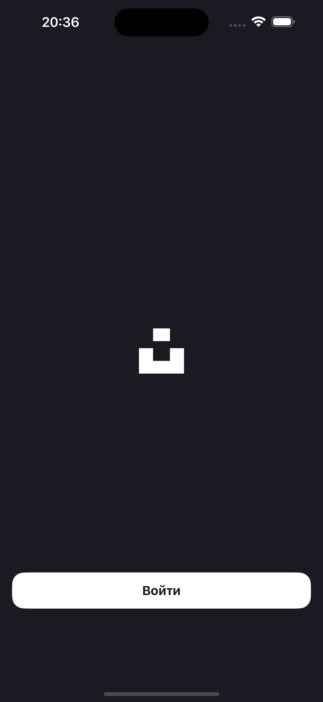
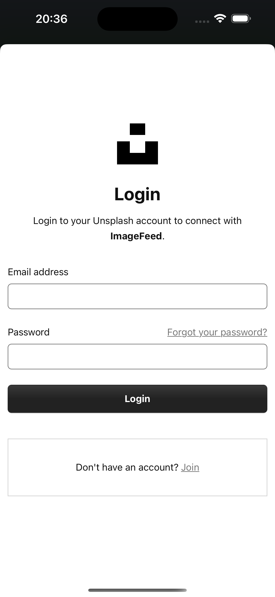
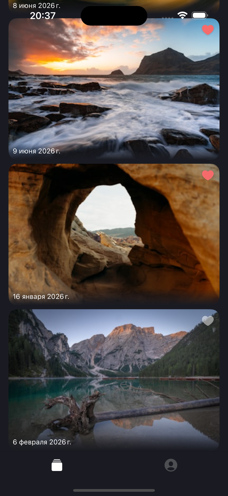
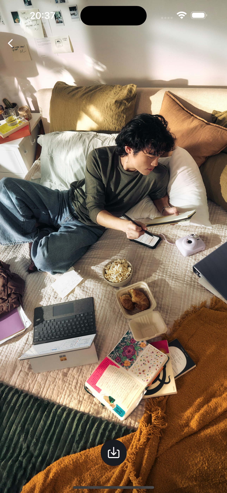
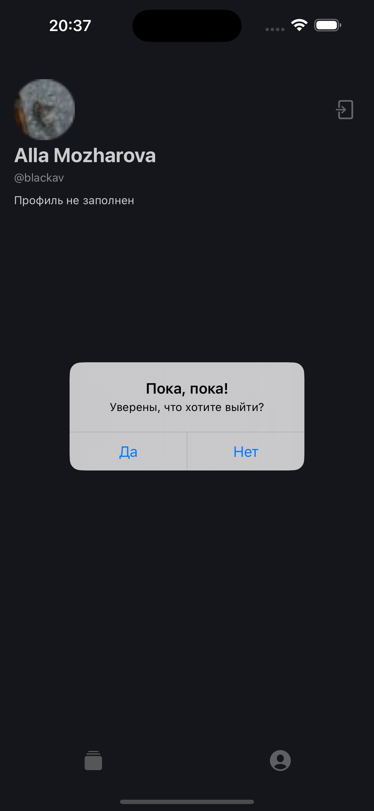

# ImageFeed

iOS-приложение для просмотра фотографий из Unsplash. Пользователь может авторизоваться через свой аккаунт, просматривать бесконечную ленту, отмечать понравившиеся изображения, открывать фотографии в полноэкранном режиме и знакомиться с данными своего профиля.

Индивидуальный проект, самостоятельно реализованный по готовым требованиям и дизайн-макетам.

## Демо

https://github.com/user-attachments/assets/ba7ae43f-b5f3-44b9-ae3d-8b51b38e1082

## Основной функционал

- Авторизация пользователя через OAuth 2.0 и Unsplash.
- Отображение прогресса загрузки страницы авторизации.
- Сохранение OAuth-токена между запусками приложения.
- Автоматический переход к основному интерфейсу при наличии активной авторизации.
- Просмотр ленты фотографий из Unsplash с постраничной загрузкой при прокрутке.
- Отображение фотографий с сохранением исходных пропорций и датой публикации.
- Добавление и удаление лайков с синхронизацией через Unsplash API.
- Просмотр фотографии в полноэкранном режиме с масштабированием и перемещением.
- Отправка изображения через системное меню «Поделиться».
- Просмотр имени, логина, описания и аватара пользователя.
- Skeleton-анимация во время загрузки фотографий и данных профиля.
- Индикация выполнения сетевых операций и обработка ошибок загрузки.
- Выход из аккаунта с подтверждением и очисткой данных авторизации.

## Требования и технологии

- iOS 13+
- Swift 5
- UIKit
- Storyboard и программная верстка
- Auto Layout
- MVP для основных модулей с сервисным слоем
- UITabBarController, UINavigationController и модальная навигация
- URLSession и Unsplash REST API
- OAuth 2.0 и WebKit
- Keychain
- XCTest: unit- и UI-тесты
- Swift Package Manager

## Зависимости

- `Kingfisher` — асинхронная загрузка, обработка и кэширование изображений.
- `ProgressHUD` — блокирующий индикатор выполнения сетевых операций.
- `SwiftKeychainWrapper` — безопасное хранение OAuth-токена в Keychain.

## Скриншоты

| Экран входа | Авторизация через Unsplash | Лента фотографий |
|:-----------:|:--------------------------:|:----------------:|
|  |  |  |

| Полноэкранный просмотр | Подтверждение выхода из профиля |
|:----------------------:|:-----------------------------:|
|  |  |

## Установка и запуск

1. Клонировать репозиторий:

```bash
git clone https://github.com/av-black/ImageFeed.git
```

2. Перейти в папку проекта:

```bash
cd ImageFeed
```

3. Открыть проект:

```bash
open ImageFeed.xcodeproj
```

4. Дождаться автоматической загрузки зависимостей через Swift Package Manager.

5. Выбрать симулятор или подключенное устройство с iOS 13+.

6. Собрать и запустить приложение.
